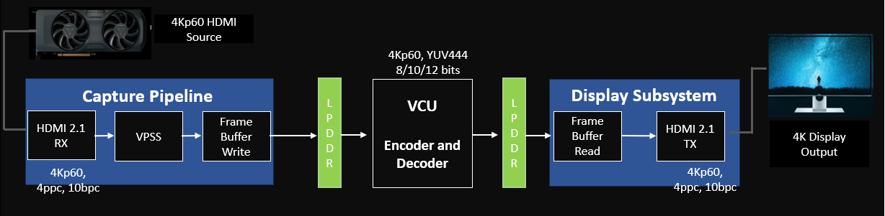
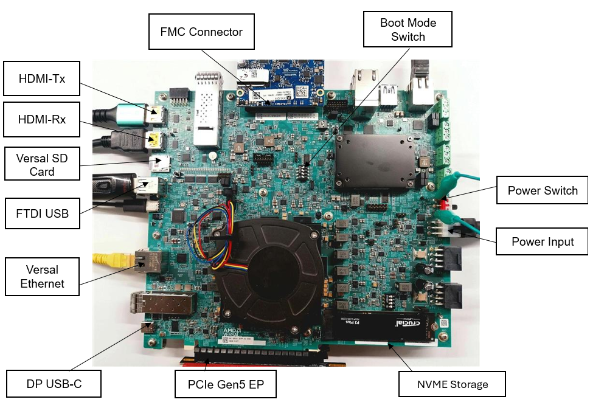
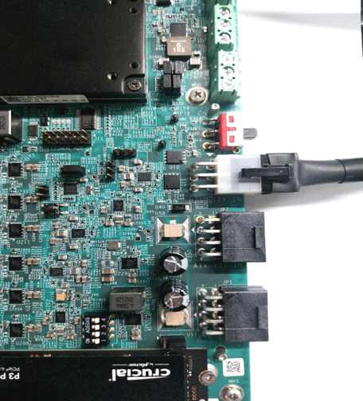
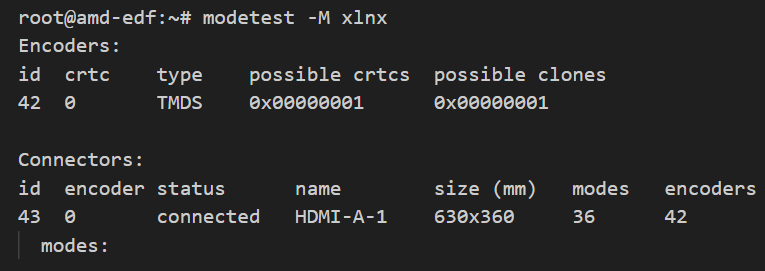
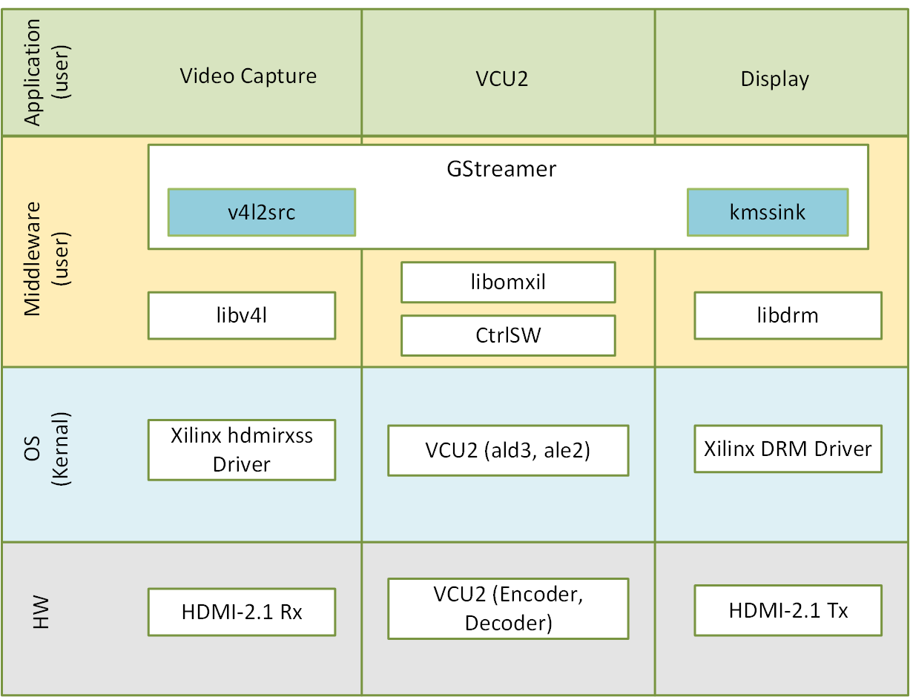
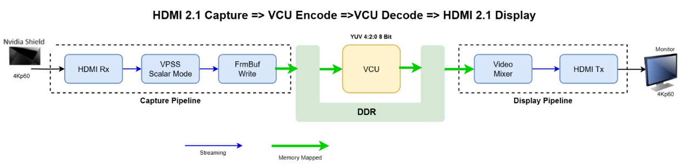

<div align = "center"> <h1 style = "text-align: center;"> Versal AI Edge Series Gen 2 - HDMI Advanced Subsystem Design  </h1></div>

## **Table of Contents**

- [**Introduction**](#introduction)
  - [**Package Directory Structure**](#package-directory-structure)
- [**Boot the Prebuilt Image**](#boot-the-prebuilt-image)
  - [**Prerequisites**](#prerequisites)
  - [**System Controller**](#system-controller)
  - [**Board Setup**](#board-setup)
    - [**Basic Board Interfaces Setup**](#basic-board-interfaces-setup)
    - [**Powering the Board**](#powering-the-board)
    - [**UART Connections - FTDI-USB**](#uart-connections---ftdi-usb)
    - [**Switch Settings**](#switch-settings)
    - [**Serial Console Settings**](#serial-console-settings)
  - [**EDF Boot Firmware (OSPI boot.bin)**](#edf-boot-firmware-ospi-bootbin)
  - [**SD Card Creation**](#sd-card-creation)
  - [**First Linux Boot**](#first-linux-boot)
- [**Run AdvSS Application**](#run-advss-application)
  - [**Run Pipeline from Command Line**](#run-pipeline-from-command-line)
  - [**Loading Overlay Images on Target**](#loading-overlay-images-on-target)
  - [**Launch Capture Pipeline**](#launch-capture-pipeline)
- [**Build Boot Loader and Linux Images**](#build-boot-loader-and-linux-images)
  - [**Prerequisites**](#prerequisites-1)
  - [**Build Flow Overview**](#build-flow-overview)
  - [**Steps to Build Hardware Design**](#steps-to-build-hardware-design)
  - [**Steps to Build Software Components**](#steps-to-build-software-components)
    - [**Prerequisites**](#prerequisites-2)
    - [**Generate SDT Files**](#generate-sdt-files)
      - [**Step-by-Step Instructions**](#step-by-step-instructions)
    - [**Generate Machine Configuration**](#generate-machine-configuration)
    - [**Customizing Device Tree to Add CMA Memory for VCU2**](#customizing-device-tree-to-add-cma-memory-for-vcu2)
    - [**Generate OSPI boot.bin**](#generate-ospi-bootbin)
    - [**Generate Linux Artifacts**](#generate-linux-artifacts)
    - [**Procedure to Generate PL Overlay Images**](#procedure-to-generate-pl-overlay-images)
      - [**Add HDMI Support**](#add-hdmi-support)
      - [**Generate Overlay Firmware**](#generate-overlay-firmware)
- [**Software Architecture of the Platform**](#software-architecture-of-the-platform)
  - [**Introduction**](#introduction-1)
  - [**Video Capture**](#video-capture)
  - [**Kernel Subsystems**](#kernel-subsystems)
  - [**Linux V4L2 Driver**](#linux-v4l2-driver)
  - [**Media Framework**](#media-framework)
  - [**V4L2 Framework**](#v4l2-framework)
  - [**Video IP Drivers**](#video-ip-drivers)
  - [**Video Codec Unit 2 (VCU2)**](#video-codec-unit-2vcu2)
  - [**Display**](#display)
    - [**KMS Sink GStreamer Plugin**](#kms-sink-gstreamer-plugin)
    - [**Libdrm**](#libdrm)
    - [**DRM/KMS Kernel Subsystem**](#drmkms-kernel-subsystem)
    - [**Direct Rendering Manager**](#direct-rendering-manager)
  - [**GStreamer**](#gstreamer)
    - [**Plugins**](#plugins)
- [**Hardware Architecture of the Platform**](#hardware-architecture-of-the-platform)
  - [**Capture Pipeline**](#capture-pipeline)
    - [**HDMI-Rx Subsystem**](#hdmi-rx-subsystem)
    - [**VPSS**](#vpss)
    - [**Frame Buffer Write**](#frame-buffer-write)
  - [**Processing Pipeline - VCU2**](#processing-pipeline---vcu2)
  - [**Display Pipeline**](#display-pipeline)
    - [**HDMI-2.1 Tx Subsystem**](#hdmi-21-tx-subsystem)
    - [**Video Mixer**](#video-mixer)
  - [**Clocks, Resets and Interrupts**](#clocks-resets-and-interrupts)
- [**Known Issues**](#known-issues)


# **Introduction**

The VEK385 AdvSS release introduces a HDMI-2.1 Rx, HDMI-2.1 Tx, and VCU2 used for various video use cases such as Real-Time Video Recording, Playback and Video Analytics, Real-Time Video Transcoding and Broadcasting.

The Hardware design is created using Vivado and features pre-instantiated I/O interfaces, connecting  capture and display pipelines and required boot images are generated using [AMD EDF](https://xilinx-wiki.atlassian.net/wiki/spaces/A/pages/3250585601/AMD+Embedded+Development+Framework+EDF) flow to support platform level development and embedded software solutions for AMD adaptive SoC and FPGA products, as well as their evaluation boards.



<p align="center">
  <strong><em><u>Figure 1: HDMI Advanced Subsystem Design</u></em></strong>
</p>

The VEK385 TRD platform captures video from HDMI-2.1 Rx source (3840x2160@60fps) and displays it on the 4K HDMI-2.1 Tx monitor. The following are the major pipelines in the hardware platform.

* Capture Pipeline:

  * HDMI-2.1 Rx 

* Processing Pipeline:

  * VCU2
  
* Display Pipeline:

  * 4K HDMI-2.1 Tx Display pipeline

* Maximum Supported Resolution:

  * 3840x2160@60

* Supported Format:

  * NV12

In 2025.2 release, VEK385 AdvSS is specifically tailored to support the pre-production Rev-B version of the VEK385 evaluation board.


## **Package Directory Structure**

This package contains prebuilt images, steps to build Hardware design, Software artifacts, and run the pipeline.

* HW
* SW
* prebuilt
* HDMI Advanced Subsystem Design.pdf
* README.md

The design file hierarchy is shown in the following:

```
VEK385_HDMI_ADVSS/
├── Versal AI Edge Series Gen 2 - HDMI Advanced Subsystem Design.pdf
├── HW
│   ├── hdmi_ss_hier.tcl
│   ├── main.tcl
│   ├── makefile
│   ├── README.md
│   ├── vcu2_ss_hier.tcl
│   └── xdc
│       ├── hdmi_vek385.xdc
│       ├── vek385_base.xdc
│       └── vek385_vcu.xdc
├── prebuilt
│   ├── edf-linux-disk-image-vek385-advss-hdmi.rootfs.wic.xz
│   ├── edf-ospi-vek385-advss-hdmi.bin
│   └── hdmi_overlay.zip
├── README.md
└── SW
    └── pl.dtsi
```


# **Boot the Prebuilt Image**

The reference design of prebuilt SD card image file (```$DOWNLOADED_PACKAGE/prebuilt/edf-linux-disk-image-<machine_name>.rootfs.wic.xz```) and OSPI boot.bin file (```$DOWNLOADED_PACKAGE/prebuilt/edf-ospi-<machine_name>.bin```) are available in the ```prebuilt``` directory.


## **Prerequisites**

* VEK385 Rev-B Board

* HDMI-Rx Source along with NVidia Shield

* 4K HDMI-Tx Monitor (must be 4K@60Hz)

* HDMI-2.1 supported Cable.

* 16GB / 32GB Micro SD card.

* Power adapter configuration -12V, 15A, 180W.

* Micro USB Cable to connect as serial with host.

* AdvSS package.

* Terminal emulator, for example

  * Windows: [teraterm](<https://osdn.net/projects/ttssh2>)

  * Linux: [picocom](<https://github.com/npat-efault/picocom/releases>)

*  [Raspberry Pi Imager](https://www.raspberrypi.com/software/) software to flash SD-card image.

## **System Controller**

> Note: If the correct System Controller (SC) QSPI Image has already been flashed to the board, skip this section.

<div align="center">

| Field | Value |
|-------|-------|
| Version | 1.23 |
| Built | May 12 2025 08:09:08 |
| Branch | master |
| Commit | xilinx_v2024.1-82-g9f504ad5fc26b3d7d4032a2ddea285d1b3e4211f |

</div>

<p align="center">
  <strong><em><u>Table 1: System Controller </u></em></strong>
</p>

The image and instructions for writing to SC QSPI are available at [System Controller enabled Evaluation Boards - System Controller firmware update](https://xilinx-wiki.atlassian.net/wiki/spaces/A/pages/3258155011/Discovery+and+Evaluation+AMD+Versal+device+portfolio#System-Controller-enabled-Evaluation-Boards---System-Controller-firmware-update).

## **Board Setup**

For VEK385 board setup details, refer to [Board Setup](https://xilinx-wiki.atlassian.net/wiki/spaces/A/pages/3258155011/Discovery+and+Evaluation+AMD+Versal+device+portfolio#Basic-board-setup---Interfaces-and-power-up) in wiki page.



<p align="center">
  <strong><em><u>Figure 2: Board Setup</u></em></strong>
</p>

### **Basic Board Interfaces Setup**

The basic board setup is as follows:

1. Connect the **External Power Supply** to the Power Input connector.

2. Connect the **USB-Type C Connector** labeled as FTDI USB to the host PC. 

3. Connect the **RJ45 Ethernet** for DUT SoC to the local network.

4. Connect the **RJ45 Ethernet** for the System Controller labeled as SC Ethernet to the local network.


### **Powering the Board**

1. Connect the **Board External Power Supply** to an outlet.
2. Plug-in the External Supply to the board.
3. Turn ON the board using the power switch.
   
   


### **UART Connections - FTDI-USB**

Evaluation boards have multiple UART connections. When the FTDI-USB cable is Plugged in, multiple device nodes are created on the host PC.

For example VEK385 has 4 serial / UART interfaces mapped as follows,
- Device 0 (Versal PS-UART0)
- Device 1 (Versal PS-UART1)
- Device 2 (Versal PL-UART)
- Device 3 (System Controller UART)

### **Switch Settings**

Configure the Versal Boot Mode switch SW1 to OSPI boot mode to boot from OSPI + SD Card: SW1[1:4]- [ON,ON,ON,OFF = 0001].

### **Serial Console Settings**

* VEK385 comes with a USB-C connector for JTAG+UART. 

* Once connected, the following four UART ports are visible in Device Manager:
  
  * PS UART0
  * PS UART1
  * PL UART
  * System Controller UART

* Connect the **USB-C Cable** to the USB-UART connector.

* Open **Two Terminal Emulator** windows.

* Choose **PS UART0** on one window and **System Controller UART** on the other window.

* Use the following settings on the Serial Port for both terminal emulators:

  * Baud Rate: 115200

  * Data: 8-bit

  * Parity: None

  * Stop: 1-bit

  * Flow Control: None


## **EDF Boot Firmware (OSPI boot.bin)**

Unzip the downloaded package. This contains ```$DOWNLOADED_PACKAGE/prebuilt/edf-ospi-<machine_name>.bin``` which is used to flash OSPI boot firmware using System Controller. 

For more details on flashing the downloaded ```$DOWNLOADED_PACKAGE/prebuilt/edf-ospi-<machine_name>.bin```, refer to [Writing the EDF boot firmware to the primary boot device / media using System Controller (SC)](https://xilinx-wiki.atlassian.net/wiki/spaces/A/pages/3258155011/Discovery+and+Evaluation+AMD+Versal+device+portfolio#Writing-the-EDF-boot-firmware-to-the-primary-boot-device-%2F-media-using-System-Controller-(SC)).

## **SD Card Creation**

1. Unzip the downloaded package, this package contains the pre-built image ```$DOWNLOADED_PACKAGE/prebuilt/edf-linux-disk-image-<machine_name>.rootfs.wic.xz```. Extract the image to ```$DOWNLOADED_PACKAGE/prebuilt/edf-linux-disk-image-<machine_name>.rootfs.wic``` image.

2. To flash ```.wic``` image into SD Card, refer to [Writing the EDF Linux® disk image (wic) to the secondary boot media: SD card](https://xilinx-wiki.atlassian.net/wiki/spaces/A/pages/3258155011/Discovery+and+Evaluation+AMD+Versal+device+portfolio#Writing-the-EDF-Linux%C2%AE-disk-image-(wic)-to-the-secondary-boot-media-%3A-SD-card).


Follow these steps mentioned [here](https://xilinx-wiki.atlassian.net/wiki/spaces/A/pages/3258155011/Discovery+and+Evaluation+AMD+Versal+device+portfolio#Writing-the-EDF-Linux%C2%AE-disk-image-(wic)-to-the-secondary-boot-media-%3A-SD-card) to flash ```$DOWNLOADED_PACKAGE/prebuilt/edf-linux-disk-image-<machine_name>.rootfs.wic``` image as described in the following steps:

1. Flash the extracted image ```$DOWNLOADED_PACKAGE/prebuilt/edf-linux-disk-image-<machine_name>.rootfs.wic``` into Micro-SD card using the [Raspberry Pi Imager](https://www.raspberrypi.com/software/).

   - Click on Choose OS.
   - Browse to the image file ```$DOWNLOADED_PACKAGE/prebuilt/edf-linux-disk-image-<machine_name>.rootfs.wic.xz```.
   - Select Choose Storage to select the SD card
   - Follow the steps in prompt to continue writing and wait until the operation is complete:
     - Click **Next**
     - Click **No** 
     - Click **Yes**

> Note: After flashing the .wic image you might not see the files in windows.


## **First Linux Boot**

Follow these steps to boot the board into Linux

1. Ensure all steps under the [Board Setup](#board-setup) section are verified.

2. Insert the prepared Micro-SD Card into the Versal SD card slot.

3. Ensure that the PS UART0 Terminal tab is connected.

4. Turn ON the Power Switch SW8.

5. On Versal PS UART0 terminal, the Versal device boots from the micro-SD card, starts with the message AMD Xilinx Versal Platform Loader and Manager.

6. The Linux boot process completes in approximately 40 seconds.

7. After boot, login with the following:

       Username: amd-edf
       Password: set new password
   

# **Run AdvSS Application**

To run the AdvSS application, complete the steps [Boot the Prebuilt Image](#boot-the-prebuilt-image).

## **Run Pipeline from Command Line**

This section describes an overview of the design, implementation, and key features of a HDMI AdvSS, covering architecture, protocols, and performance considerations for high-speed networking solutions. 


## **Loading Overlay Images on Target**

1. Get the overlay artifacts using TFTP:
       
       tftp
       get hdmi_overlay.zip
       quit


2. Unzip the overlay directory.

       unzip  hdmi_overlay.zip && sync
       

4. Copy the hdmi_overlay to ```/lib/firmware/xilinx/```.

       cp -rf hdmi_overlay /lib/firmware/xilinx/ && sync
       

5. Run the following command to load the overlay firmware:

       dfx-mgr-client -load hdmi_overlay


## **Launch Capture Pipeline**


1. Using Modest command and verify connector ID.

       modetest -M xlnx

   * After running the modetest command, observe the connectors details:

      

2. In the following command, add the connector ID.

       modetest -D vmixer_id -s <connector_id>:<resolution>-<refresh_rate>@<pixel_format>
       modetest -D b00c0000.v_mix -s 43:3840x2160@BG24

3. Configure media pipeline formats for the VProcSS video processing subsystem by setting input pad 0 to RGB888 and output pad 1 to VYYUYY8 at 3840x2160 resolution using ```media-ctl```.

       media-ctl -d /dev/media0 -V '"b0000000.v_proc_ss":0 [fmt:RBG888_1X24/3840x2160field:none]'
       media-ctl -d /dev/media0 -V '"b0000000.v_proc_ss":1 [fmt:VYYUYY8_1X24/3840x2160field:none]'
 

6. Run the GStreamer pipeline to launch the ISP:

   * HDMI Rx + TX:

         gst-launch-1.0 v4l2src device=/dev/video0 io-mode=4 ! video/x-raw,width=3840,height=2160,format=NV12,framerate=30/1 !  kmssink bus-id="b00c0000.v_mix" show-preroll-frame=false -vvv &

   * VCU2 + Display:

         gst-launch-1.0 videotestsrc  !  video/x-raw, width=3840, height=2160, format=NV12, framerate=60/1 !  omxh265enc  ! video/x-h265, profile=main, alignment=au ! queue ! omxh265dec internal-entropy-buffers=5 low-latency=0 ! queue max-size-bytes=0 ! kmssink bus-id=b00c0000.v_mix plane-id=35 show-preroll-frame=false sync=true -v 

   * HDMI Rx + VCU2 + Tx

         gst-launch-1.0 v4l2src device=/dev/video0 io-mode=4 ! video/x-raw, width=3840, height=2160, format=NV12, framerate=60/1 ! omxh265enc  qp-mode=auto gop-mode=basic gop-length=60 b-frames=0 target-bitrate=60000  control-rate=constant prefetch-buffer=true low-bandwidth=false ! video/x-h265, profile=main, alignment=au ! queue ! omxh265dec internal-entropy-buffers=5 low-latency=0 ! queue max-size-bytes=0 ! fpsdisplaysink name=fpssink text-overlay=false fps-update-interval=1000 video-sink="kmssink bus-id=b00c0000.v_mix  plane-id=35  show-preroll-frame=false"  -v

> Note: Use Ctrl+C to close the GStreamer pipeline.


# **Build Boot Loader and Linux Images**

This section provides step-by-step instructions to build the Boot Loader, Linux Kernel Image, Rootfs, and System Device-tree.

## **Prerequisites**

* Reference Design source files

* Vivado Design Suite 2025.2

* Vitis Unified Software Platform 2025.2

* AMD EDF Yocto 25.05

* Linux host machine

## **Build Flow Overview**

Both Hardware and Software build steps are explained in detail in subsequent tutorials.

## **Steps to Build Hardware Design**

1. Source the Vivado and Vitis 2025.2_released tool.

2. Run the following commands one after the other.
   
       cd $working_dir/VEK385_HDMI_ADVSS/HW/
       make all
    *  The ```make all``` command generates the XSA for the target platform using Vivado tool.

4. The following is the output product of above steps.


   * XSA

         
         $working_dir/VEK385_HDMI_ADVSS/HW/runs/hdmi_advss_ced_prj_$epoch/versal_gen2_platform.xsa


## **Steps to Build Software Components**

Follow the steps from the AMD EDF document to build the OSPI `boot.bin` and `.wic.xz` files.

### **Prerequisites**

1. Set up the Yocto build environment as described in the [Yocto Project build setup instructions for EDF](https://xilinx-wiki.atlassian.net/wiki/spaces/A/pages/3258089693/Operating+System+Integration+and+Development+AMD+Versal+device+portfolio#Yocto-Project-build-setup-instructions-for-EDF) wiki page.

2. Perform steps 1-4 in [EDF Linux disk image build using a prebuilt Yocto Project machine](https://xilinx-wiki.atlassian.net/wiki/spaces/A/pages/3258089693/Operating+System+Integration+and+Development+AMD+Versal+device+portfolio#EDF-Linux%C2%AE-disk-image-build-using-a-prebuilt-Yocto-Project-machine-and-pre-built-Vivado-artifacts-(PDI)---Multi-stage-boot-(QSPI-%2F-OSPI-%E2%86%92-SD-%2F-UFS)) to add the meta-xilinx-restricted-VEK385 layer to the build.

### **Generate SDT Files**

Use the ```SDTGEN``` tool to generate the System Device Tree (SDT) files required for building the device tree with custom hardware configurations.

#### **Step-by-Step Instructions**

1. Source the Vivado environment (use a different terminal). 

        source <vivado_2025.2_path>/installs/lin64/2025.2/Vivado/settings64.sh

2. Run the ```sdtgen``` command, which launches an sdtgen console. Follow these steps on the console to generate dt artifacts.


       sdtgen% sdtgen
       sdtgen% set_dt_param -dir <out directory> -xsa <path-to-xsa> -board_dts versal2-vek385-revA
       For example: set_dt_param -dir sdt_out -xsa hdmi_advss.xsa -board_dts versal2-vek385-revA

       sdtgen% generate_sdt

       sdtgen% exit


   * ```sdt_out``` folder is created with device-tree source files.


### **Generate Machine Configuration**

After SDT generation, run the ```gen-machineconf``` tool to provide device-tree source files as an input to the Yocto project with a custom gen-machine name.


    gen-machineconf parse-sdt --hw-description <above created sdtgen folder> -c conf -l conf/local.conf -g full --machine-name <machine-name> -O versal-2ve-2vm-vek385-sdt-seg

    Example: gen-machineconf parse-sdt --hw-description sdt_out -c conf -l conf/local.conf -g full --machine-name hdmi-advss -O versal-2ve-2vm-vek385-sdt-seg


> Note: Pass a custom machine-name in the gen-machineconf command. This name is used in subsequent steps for generating boot.bin.


### **Customizing Device Tree to Add CMA Memory for VCU2**

1. Update the ```versal-2ve-2vm-vek385-sdt-seg-system-conf.dtsi``` file in the following location:


       vim sources/meta-xilinx-restricted-vek385/recipes-bsp/device-tree/files/versal-2ve-2vm-vek385-sdt-seg-system-conf.dtsi


2. Copy and paste the following content to ```versal-2ve-2vm-vek385-sdt-seg-system-conf.dtsi``` required by the ISP Linux driver.

        
       / bootargs = "earlycon=pl011,mmio32,0xf1930000 console=ttyAMA1,115200 cma=1000M";
        

### **Generate OSPI boot.bin**

This step creates the ```OSPI boot.bin``` file containing essential boot components (PLM, ATF, U-Boot, and FPGA bitstream) required for VEK385 board initialization from OSPI flash memory.

1. Replace machine name ```<hdmi-advss>``` with the actual machine name used in gen-machineconf.


        MACHINE=<hdmi-advss> bitbake edf-ospi

2. After a successful build, target machine images are available in the relevant output directory ```${TMPDIR}/deploy/images/${MACHINE}/```.

        <your TMPDIR>/deploy/images/<machine-name>/
        edf-ospi-*boot.bin


### **Generate Linux Artifacts**

This step builds the Linux kernel image and rootfs containing the necessary drivers and applications for the surround view system.

1. Add the following to ```local.conf``` file to get HDMI modules along with the VCU2 utilities Firmware in rootfs.


       IMAGE_INSTALL:append = "kernel-module-vcu2 vcu2-ctrlsw libvcu2-omxil vcu2-firmware  kernel-module-hdmi21  packagegroup-xilinx-gstreamer libdrm libdrm-tests v4l-utils media-ctl yavta v4l-utils"

   * This is necessary to include HDMI 2.1 kernel driver.

2. To generate kernel image and rootfs, run the following command. 


       MACHINE=amd-cortexa78-mali-common bitbake edf-linux-disk-image

3. After the Yocto build, the kernel image and rootfs are generated at the following output location:


       <your TMPDIR>/deploy/images/<machine-name>/
       rootfs (edf-linux-disk-image-<machine-name>.rootfs-<timestamp>.wic)
       Image


### **Procedure to Generate PL Overlay Images**

The PL overlay image contains the pipeline design and corresponding DT nodes.

The following changes are added to ```pl.dtsi``` before compiling to a device-tree blob overlay (```*.dtbo```). These changes are necessary for the ISP pipeline to initialize and operate correctly.

1. To convert the dtsi to dtbo, collect ```pl.dtsi``` from the ```pl_overlay``` folder in the following build directory.

       vim <yocto_build_tempdir_path>/build/conf/dts/<Machine>/pl_overlay/pl.dtsi


#### **Add HDMI Support**

The following changes are added to ```pl.dtsi``` before compiling to a Device Tree Blob Overlay (```*.dtbo```). These changes are necessary for the HDMI pipeline to initialize and operate correctly.

Refer to [AMD Xilinx DRM KMS HDMI 2.1 TX Subsystem Driver - AMD Xilinx Wiki - Confluence](https://xilinx-wiki.atlassian.net/wiki/spaces/A/pages/2915205121/Xilinx+DRM+KMS+HDMI+2.1+TX+Subsystem+Driver).


    &amba_pl {
            ref40:  ref40m {
                    compatible = "fixed-clock";
                    #clock-cells = <0>;
                    clock-frequency = <40000000>;
                    };
    xfmc: xv_fmc {
                    compatible = "vfmc";
            };
    };
    &display_hdmi_ss_axi_iic_hdmi{
                  idt_241: clock-generator@6c {
                            compatible = "idt,idt8t49";
                            #clock-cells = <1>;
                            reg = <0x6c>;
                            clocks = <&ref40>;
                            clock-frequency = <148500000>;
                            clock-names = "input-xtal";
                    };
                    ti_tmds1204_tx: ti_tmds1204-tx@5e {
                            compatible = "ti_tmds1204,ti_tmds1204-tx";
                            #clock-cells = <1>;
                            reg = <0x5e>;
                            clocks = <&ref40>;
                            clock-frequency = <148500000>;
                            clock-names = "input-xtal";
                    };
                    ti_tmds1204_rx: ti_tmds1204-rx@5b {
                            compatible = "ti_tmds1204,ti_tmds1204-rx";
                            #clock-cells = <1>;
                            reg = <0x5b>;
                            clocks = <&ref40>;
                            clock-frequency = <148500000>;
                            clock-names = "input-xtal";
                    };
    };
    &display_hdmi_ss_hdmiphy_ss_0_hdmi_gt_controller{
        clock-names = "apb_clk" , "axi4lite_aclk" , "gt_refclk1_odiv2" , "gt_refclk2_odiv2" , "gt_txusrclk" , "sb_aclk" , "tx_axi4s_aclk","vid_phy_axi4lite_aclk", "drpclk", "tmds_clock";
        clocks = <&misc_clk_0>, <&misc_clk_0>, <&misc_clk_1>, <&misc_clk_2>, <&misc_clk_3>, <&misc_clk_0>, <&misc_clk_3>,<&misc_clk_0>, <&misc_clk_0>,<&idt_241 1>;
                    xlnx,hdmi-connector = <&xfmc>;
    };
    &i2c0 {
            expander@74 {
                    compatible = "expander-fmc74";
                    reg = <0x74>;
            };
    };

1. Update ```xlnx,max-bits-per-component = /bits/ 8 <0x8>;``` in the ```v_hdmi_rxss1@b0060000``` and ```v_hdmi_txss1@b0040000``` nodes.

2. Update ```xlnx,video-width = <8>;``` in the ```v_frmbuf_wr@b00a0000```  and ```v_proc_ss@b0000000``` nodes.

3. Update ```xlnx,bpc = <8>;``` in the ```v_mix@b00c0000``` node.

> Note: Refer to ```pl.dtsi``` in the downloaded package.

#### **Generate Overlay Firmware**

This step creates the overlay firmware package containing the device tree blob overlay (dtbo), shell configuration, and FPGA programming file needed for dynamic FPGA configuration.

1. After the steps from [Procedure to Generate PL Overlay Images](#procedure-to-generate-pl-overlay-images) are completed, convert the ```pl.dtsi``` to ```dtbo``` (overlay dtb).

       convert to dtbo
       dtc -I dts -O dtb -@ -o pl.dtbo pl.dtsi

2. Collect ```*pld.pdi``` from the sdtgen output directory in [Generate SDT Files](#generate-sdt-files).

3. Create a file named ```shell.json``` and add the following content:

       cat > shell.json <<EOL
       {
       "shell_type" : "XRT_FLAT",
       "num_slots" : "1"
       }
       EOL

4. Copy ```.dtbo```, ```shell.json``` and ```*pld.pdi``` into a folder ```hdmi_overlay/```. 

5. The overlay firmware files are ready.

        Directory Structure:
          hdmi_overlay/
          ├── pl.dtbo
          ├── shell.json
          └── versal_gen2_platform_wrapper_pld.pdi

6. Copy the folder to USB storage, refer to [Run AdvSS Application](#run-advss-application).


# **Software Architecture of the Platform**

## **Introduction**

This chapter describes the application processing unit (APU) Linux software stack and Vertical Domains.



<p align="center">
  <strong><em><u>Figure 4: Software Stack </u></em></strong>
</p>


The stack is horizontally divided into the following layers:

* Application layer (user-space)

  * Application scripts to run the pipeline
  * GStreamer multimedia framework for video
      pipeline control

* Middleware layer (user-space)

  * Implements and exposes domain-specific functionality by means of
      GStreamer plugins to interface with the application layer
  * Provides access to kernel frameworks

* Operating system (OS) layer (kernel-space)

  * Provides a stable, well-defined API to user-space
  * Includes device drivers and kernel frameworks (subsystems)
  * Access to hardware IPs

Vertically, the software components are divided by domain:

* Video capture
* Processing subsystem
* Display

## **Video Capture**

At a high level, Video Capture Software Stack consists of the following layers from top to bottom:

* User-space layers

  * GStreamer: v4l2src plugin
  * libdrm: DRM user-space
  * Media controller: Library to configure v4l subdevices and media
      devices

* Kernel-space layers

  * V4L2/Media subsystems: AMD Xilinx video IP pipeline (XVIPP) driver
  * DRM/KMS subsystem: Xilinx DRM driver 
  * DMA engine: Xilinx framebuffer driver 
  * Mixer Driver 
  

## **Kernel Subsystems**

In order to model and control video capture pipelines such as the ones used in this AdvSS on Linux systems, multiple kernel frameworks and APIs are required to work in concert. For simplicity, refer to the overall solution as Video4Linux (V4L2) although the framework only provides part of the required functionality. The individual components are discussed in the following sections.

## **Linux V4L2 Driver**

In the Capture section, it describes how the generic V4L2 driver model of a video pipeline aligns with the HDMI-Rx capture pipelines. The video pipeline driver initiates the loading of necessary sub-device drivers and registers the required device nodes, all based on the video pipeline configuration specified in the device tree. The framework provides the following device node types to user space for controlling specific aspects of the pipeline:

* Media device node: /dev/media*
* Video device node: /dev/video*
* V4L2 sub-device node: /dev/v4l-subdev*


## **Media Framework**

The main goal of the media framework is to discover the device topology of a video pipeline and to configure it at run-time. To achieve this, pipelines are modeled as an oriented graph of building blocks called entities connected through pads.

An entity is a basic media hardware building block. It can correspond to a large variety of blocks such as physical hardware devices (e.g., image sensors), logical hardware devices (e.g., soft IP cores inside PL), DMA channels or physical connectors. Physical or logical devices are modeled as sub-device nodes and DMA channels as video nodes.

A pad is a connection endpoint through which an entity can interact with other entities. Data produced by an entity flows from the entities output to one or more entity inputs. A link is a point-to-point oriented connection between two pads, either on the same ntity or on different entities. Data flows from a source pad to a sink pad.


## **V4L2 Framework**

The V4L2 framework is responsible for capturing video frames at the video device node, typically representing a DMA channel, and making those video frames available to user space. The framework consists of multiple sub-components that provide certain functionality. 

Before video frames can be captured, the buffer type and pixel format need to be set using the ```VIDIOC_S_FMT``` ioctl. On success the driver can program the hardware, allocate resources, and generally prepare for data exchange. Optionally, you can set additional control parameters on V4L devices and sub-devices. The V4L2 control framework provides ioctls for many commonly used, standard controls such as brightness and contrast.

The videobuf2 API implements three basic buffer types but only physically contiguous memory is supported in this driver because of the hardware capabilities of the Frame Buffer Write IP. Videobuf2 provides a kernel internal API for buffer allocation and management as well as a user space facing API. ```VIDIOC_QUERYCAP``` and ```VIDIOC_REQBUFS``` ioctls are used to determine the I/O mode and memory type. In this design, the streaming I/O mode in combination with the DMABUF memory type is used.

DMABUF is dedicated to sharing DMA buffers between different devices, such as V4L devices or other video-related devices such as a DRM display device (see the GStreamer Pipeline Control section). In DMABUF, buffers are allocated by a driver on behalf of an application. These buffers are exported to the application as file descriptors.

For capture applications, it is customary to queue a number of empty buffers using the
```VIDIOC_QBUF``` ioctl. The application waits until a filled buffer can be de-queued with the ```VIDIOC_DQBUF``` ioctl and re-queue the buffer when the data is no longer needed. To start and stop capturing applications, the ```VIDIOC_STREAMON``` and ```VIDIOC_STREAMOFF``` ioctls are used.

The ioctls for buffer management, format and stream control are implemented inside the v4l2src plugin and the application developer does not need to know the implementation details.


## **Video IP Drivers**

Sets media bus format and resolution on output pad. Sets sensor control parameters: exposure, gain, test pattern, h/v flip, r/g/b balance. AMD Xilinx adopted the V4L2 framework for most of its video IP portfolio. The currently supported video IPs and corresponding drivers are listed under V4L2. Each V4L driver has a sub-page that lists driver-specific details and provides pointers to additional documentation.


## **Video Codec Unit 2 (VCU2)**

 
 The VCU2 core is capable of compressing and decompressing video streams simultaneously at resolutions of up to 3840 × 2160 pixels at 60 frames per second (4K UHD at 60 fps). H.264/H.265/JPEG (Decode only) functionality is implemented as an embedded hard IP inside.
 
GStreamer is a cross-platform open-source multimedia framework. GStreamer provides the infrastructure to integrate multiple multimedia components and create pipelines. The GStreamer plugin is implemented using OpenMAX Integration Layer APIs. 
The OpenMAX Integration Layer API defines a royalty-free standardized media component interface to enable developers and platform providers to integrate and communicate with multimedia codecs implemented in hardware or software. 
The VCU2 Control Software is the lowest level software visible to VCU2 application developers. 
All VCU2 applications must use the AMD provided VCU2 Control Software, directly or indirectly. The VCU2 Control Software includes custom kernel modules, custom user space library, and the ctrlsw_encoder and ctrlsw_decoder applications. The OpenMAX IL (OMX) layer is integrated on top of the VCU2 Control Software. VCU2 Control Software is mostly running on the MCU, with the kernel driver merely implementing an API Proxy. 
User applications can use the layer or layers of the VCU2 software stack that are most appropriate to their requirements. 

For more information, refer to H.264/H.265/JPEG Video Codec Unit 2 (VCU2) Solutions [(PG-447)](https://docs.amd.com/r/en-US/pg447-vcu2-solutions).


## **Display**

Display software stack consists of the following layers from top to bottom which are further described in the next sections:

* User-space layers

  * GStreamer: KMS sink plugin
  * libdrm: DRM user-space library

* Kernel-space layers

  * DRM/KMS subsystem: AMD Xilinx DRM driver
  * DMA engine: AMD framebuffer driver
  * Mixer Driver

### **KMS Sink GStreamer Plugin**

The kmssink element interfaces with the DRM/KMS Linux framework and the AMD DRM driver
through the libdrm library and the dri-card device node.

The kmssink element library uses the libdrm library to configure the cathode ray tube controller
(CRTC) based on the monitor's extended display identification data (EDID) information with the
video resolution of the display. It also configures plane properties such as the alpha value.

### **Libdrm**

The DRM/KMS framework exposes two device nodes to user space: the ```/dev/dri/card``` device
node and an emulated ```/dev/fb*``` device node for backward compatibility with the legacy fbdev
Linux framework. The latter is not used in this design. libdrm was created to facilitate the
interface of user space programs with the DRM subsystem. This library is merely a wrapper that
provides a function written in ```C``` for every ioctl of the DRM API, as well as constants, structures,
and other helper elements. The use of libdrm not only avoids exposing the kernel interface
directly to user space but presents the usual advantages of reusing and sharing code between
programs.

### **DRM/KMS Kernel Subsystem**

Linux kernel and user-space frameworks for display and graphics are intertwined, and the
software stack can be quite complex with many layers and different standards/APIs. On the
kernel side, the display and graphics portions are split with each having their own APIs. However,
both are commonly referred to as a single framework: DRM/KMS.

This split is advantageous, especially for SoCs that often have dedicated hardware blocks for
display and graphics. The display pipeline driver responsible for interfacing with the display uses
the kernel mode setting (KMS) API and the GPU responsible for drawing objects into memory
uses the direct rendering manager (DRM) API. Both APIs are accessed from user-space through a
single device node.

A brief overview of the DRM is provided but the focus is on KMS as there is no GPU present in
the design.

### **Direct Rendering Manager**

The AMD DRM driver uses the Graphics Execution Manager (GEM) memory manager and
implements DRM PRIME buffer sharing. PRIME is the cross-device buffer sharing framework in
DRM. To user-space PRIME buffers are DMABUF-based file descriptors. The DRM GEM/CMA
helpers use the Continuous Memory Access (CMA) allocator as a means to provide buffer objects
that are physically contiguous in memory. This is useful for display drivers that are unable to map
scattered buffers via an I/O memory management unit (IOMMU).

Frame buffers are abstract memory objects that provide a source of pixels to scan out to a CRTC.
Applications explicitly request the creation of frame buffers and receive an opaque handle that
can be passed to the KMS CRTC control, plane configuration, and page flip functions.

## **GStreamer**

GStreamer is a cross-platform open-source multimedia framework that provides infrastructure to
integrate multiple multimedia components and create pipelines/graphs. GStreamer graphs are
made of two or more plugin elements which are delivered as shared libraries. The following is a
list of commonly performed tasks in the GStreamer framework:

* Selection of a Source GStreamer plugin
* Selection of a Sink GStreamer plugin
* Creation of a GStreamer Graph based on above plugins Capabilities.
* Configuration of properties of above GStreamer plugins
* Control of a GStreamer Pipeline/Graph

### **Plugins**

The following GStreamer plug-in categories are used in this design:

* Source
 	* v412src: HDMI-Rx

* Sink
 	* kmssink: KMS display sink for HDMI-Tx

* Processing/Acceleration
 	* GST OMX plugins like omxh265enc and omxh265dec 

* Other
 	* capsfilter: filters capabilities

 	* queue: creates separate threads between pipeline elements and adds additional buffering
 	* perf: measure frames-per-seconds (fps) at an arbitrary point in the pipeline


# **Hardware Architecture of the Platform**

This chapter describes the HDMI Advanced Subsystem hardware design architecture.



<p align="center">
  <strong><em><u>Figure 5: Hardware Design </u></em></strong>
</p>

These are the three major subsystems used in this AdvSS design:

* **Capture Pipeline:** HDMI-2.1 Rx subsystem

* **VCU Subsystem:** Processing pipeline

* **Display Pipeline:** HDMI-2.1 Tx subsystem

## **Capture Pipeline**

A capture pipeline receives frames from an external source and writes them into memory. The capture pipeline has the following subsystem/IPs.

* HDMI-2.1 Rx Subsystem

* Video Processing Subsystem

* Frame Buffer Write IP


### **HDMI-Rx Subsystem**

The hardware configurations of HDMI-2.1 Rx subsystem are given in the following:

<div align="center">

| Configuration | HDMI-2.1 Rx Subsystem |
|-------|--------------|
| Video Interface	| AXI4-Stream |
| Maximum Bits per component	| 10 |
| Number of Pixel per Clock on video interface	| 4 |
| Number of GT lanes	| 4 |
| EDID RAM Size	| 256 |
| Hot Plug Detect Active	| Low |
| Cable Detect Active	| Low |
| Video Bridge - FIFO Depth	| 1024 |
| Video Bridge - Hysteresis Level	| Not Applicable |

</div>

<p align="center">
  <strong><em><u>Table 2: Hardware Configuration of HDMI-Rx Subsystem </u></em></strong>
</p>

### **VPSS**

For video processing subsystem (VPSS), see the Video Processing Subsystem Product Guide [(PG231)](https://docs.xilinx.com/v/u/2.0-English/pg231-v-proc-ss) is a collection of video processing IP subcores. This instance uses the scaler only configuration which provides scaling, color space conversion, and chroma resampling functionality. A GPIO is used to reset the subsystem between resolution changes.

The hardware configurations of VPSS IP are given in the following:

<div align="center">

| Configuration | VPSS |
|-------|--------------|
| Samples per Clock | 4 |
| Maximum Data Width | 10 |
| Maximum Number of Pixels | 8192 |
| Maximum Number of Lines | 4320 |
| Video Processing Functionality | Scaler only |
| Color Space Support | RGB: YUV 4:4:4, YUV 4:2:2, YUV 4:2:0 |
| Scalar -Algorithm | Polyphase |

</div>

<p align="center">
  <strong><em><u>Table 3: Hardware Configuration of VPSS </u></em></strong>
</p>

### **Frame Buffer Write**

For video frame buffer, see the Video Frame Buffer Read and Video Frame Buffer Write LogiCORE IP Product Guide [(PG278)](https://docs.xilinx.com/v/u/1.0-English/pg278-v-frmbuf) takes AXI4-Stream input data in 24-bit RGB format and converts it to AXI4-mm format which is written to memory. The AXI4-mm interface is connected to the system DDR through NoC. For each video frame transfer, an interrupt is generated. A GPIO is used to reset the IP between resolution changes.

The hardware configurations of Frame Buffer Write IP are given in the following:

<div align="center">

| Configuration | Frame Buffer Write |
|-------|--------------|
| Samples Per Clock	| 4 |
| Maximum number of Columns	| 8192 |
| Maximum number of Rows	| 4320 |
| Maximum Data Width	| 10 |
| Address Width	| 32 |
| Memory Video Format	| Raster |
| Interlaced Support	| Yes |
| Formats	| All 8/10 bit formats |

</div>

<p align="center">
  <strong><em><u>Table 4: Hardware Configuration of Frame Buffer Write </u></em></strong>
</p>

## **Processing Pipeline - VCU2**

VCU2 is a Hard IP for encoding and decoding video stream. For detailed information on VCU2 subsystem and the supported formats, refer to H.264/H.265/JPEG Video Codec Unit 2 (VCU2) Solutions LogiCORE IP Product Guide ([PG447](https://docs.amd.com/r/en-US/pg447-vcu2-solutions)).

The hardware configurations of VCU2 IP are given in the following:

<div align="center">

| Configuration | VCU2 |
|-------|--------------|
| Basic Configuration	| <ul><li>Enable Encoder</li><li>Enable Decoder</li> </ul> |
| Encoder Options	| <ul><li>MCU Core Clk - 950 MHz</li><li>Resolution - 4096x2160</li> <li>FPS 60</li><li>Color Format - 4:4:4 </li><li>Color Depth - 12 bpc</li><li>Source Format - Raster</li></ul> |
| Decoder Options | <ul><li>MCU Core Clock - 918 MHz</li><li>Resolution - 4096x2160</li><li>FPS 60</li><li>Color Format - 4:4:4 </li><li>Color Depth - 12 bpc</li><li>Source Format - Raster</li></ul> |

</div>

<p align="center">
  <strong><em><u>Table 5: Hardware Configuration of VCU2 </u></em></strong>
</p>


## **Display Pipeline**

An output pipeline reads video frames from memory and sends the frames to a sink. In this case the sink is a display and therefore this pipeline is also referred to as a display pipeline. The Display Pipeline has the following Subsystems/IPs all are controlled by the APU through an AXI4-Lite base register interface:

* HDMI-2.1 Tx Subsystem

* Video Mixer

### **HDMI-2.1 Tx Subsystem**

The HDMI transmitter subsystem (HDMI-Tx) interfaces with PHY layers and provides HDMI encoding functionality. The subsystem is a hierarchical IP that bundles a collection of HDMI-Tx related IP sub-cores and outputs them as a single IP. The subsystem generates an HDMI stream from the incoming AXI4-Stream video data and sends the generated link data to the video PHY layer. For more information, refer to the HDMI 2.1 Transmitter Subsystem v1.2 Product Guide ([PG350](https://docs.amd.com/r/en-US/pg350-v-hdmi-txss1?tocId=wx22mfQN_Vxgr5Vmgrv8jw)).

The HDMI GT controller and PHY (GT) enables plug-and-play connectivity with the video transmit or receive subsystems. The interface between the media access control (MAC) and physical (PHY) layers are standardized to enable ease of use in accessing shared gigabit-transceiver (GT) resources. The data recovery unit (DRU) is used to support lower line rates for the HDMI protocol. An AXI4-Lite register interface is provided to enable dynamic accesses of transceiver controls/status. For more information, refer to HDMI GT Controller LogiCORE IP Product Guide ([PG334](https://docs.amd.com/r/en-US/pg334-hdmi-gt-controller/Introduction)).

The hardware configurations of HDMI-2.1 Tx IP are given in the following:

<div align="center">

| Configuration | HDMI-2.1 Tx Subsystem |
|-------|--------------|
| Video Interface	| AXI4-Stream |
| Maximum Bits per Component	| 10 |
| Number of Pixels per Clock on Video Interface	| 4 |
| Number of GT Lanes	| 4 |
| Hot Plug Detect Active	| Low |
| Video Bridge - Hysteresis Level	| 511 |
| FIFO Depth	| 1024 |

</div>

<p align="center">
  <strong><em><u>Table 6: Hardware Configuration of HDMI-2.1 Tx Subsystem </u></em></strong>
</p>

### **Video Mixer**

The video mixer IP core is configured to support two overlay layers connected to the NoC through interconnects. The main AXI-MM layer has the resolution set to match the display. A GPIO is used to reset the subsystem between resolution changes. For more information, refer to the input interface Video Mixer LogiCORE IP Product Guide ([PG243](https://docs.amd.com/r/en-US/pg243-v-mix)).

The hardware configurations of Video Mixer IP are given in the following:

<div align="center">

| Configuration | Video Mixer |
|-------|--------------|
| Streaming Video Format	| RGB |
| Samples per Clock	| 4 |
| Maximum Data Width 	| 10 |
| Number of Overlay Layers	| 2 |
| Maximum Number of Columns	| 8192 |
| Maximum Number of Rows	| 4320 |
| Address Width	| 32 |
| Layer -1 (Enable Global Alpha - Yes)	| YUV8 420 |
| Layer -2 (Enable Global Alpha - Yes)	| YUV10 420 |

</div>

<p align="center">
  <strong><em><u>Table 7: Hardware Configuration of Video Mixer </u></em></strong>
</p>

> Note: The mixer configuration remains the same for different capture sources. To enable or disable various layers, software programs enable the layer register in the IP


## **Clocks, Resets and Interrupts**

The following table lists the clock frequencies of key ACAP components and memory. For more information, refer to the Versal ACAP Technical Reference Manual ([AM026](https://docs.amd.com/r/en-US/am026-versal-ai-edge-prime-gen2-trm))

<div align="center">

| Component | Clock Frequency |
|-----------|-----------------|
| APU       | 1,300 MHz       |
| NOC       | 1,000 MHz       |
| NPI       | 300 MHz         |
| LPDDR     | 4266.5          |

</div>

<p align="center">
  <strong><em><u>Table 8:  Key Component Clock Frequencies </u></em></strong>
</p>


The following table identifies the main clocks of the PL design, their source, their clock frequency, and their function.

<div align="center">

| Clock | Source | Frequency | Function |
|-------|--------------|-----------------|----------|
| pI0_ref_clk | ps_wizard_0 | 100 MHz | Clock source for clocking wizard |
| clk_150 | Clocking wizard 0 | 150 MHz | AXI-Lite clock to configure the different IPs in the design. |
| clk_300 | Clocking wizard 0 | 300 MHz | AXI MM clock and AXI Stream clock used in the capture and display pipeline |
| clk_450 | Clocking wizard 0 | 450 MHz | FRL clock for HDMI-Tx subsystem |
| clk_133 | Clocking wizard 0 | 133 MHz | VCU2 DPLL Reference clock |
| HDMI DRU Clock | VEK385 Board | 400 MHz | Clock for data recovery unit for low line rates |
| HDMI GT Tx Ref Clock | VEK385 Board | Variable | GT Transmit clock source to support various HDMI reference clock |
| HDMI GT Rx Ref Clock | VEK385 Board | Variable | GT Receive clock source to support various HDMI reference clock |

</div>

<p align="center">
  <strong><em><u>Table 9: System Clocks </u></em></strong>
</p>

The following table summarizes the PS and PL resets used in this design.
The master reset ```(pl_resetn0)``` is generated by the PS during boot and is used as input to the five-processing system (PS) reset modules in the PL. Each module generates synchronous, active-Low and active-High interconnect and peripheral resets that drive all IP cores synchronous to the respective clock domains.

Apart from these system resets, there are asynchronous resets driven by PS GPIO pins. The respective device drivers control these resets which can be toggled at run-time to reset HLS based cores. The following table summarizes the PL resets used in this design.


<div align="center">

| Reset Source | Purpose |
| :---------| :---------------|
| pI0_resetn | PL reset for proc_sys_reset modules |
| rst_clk | Synchronous resets for clk_150 clock domain |
| proc_sys_rst_300MHz | Synchronous resets for clk_300 clock domain |
| ***GPIO Rst for Capture Pipeline*** | |
| frm_buf_rst_gpio | Bit 0-asynchronous reset for the frame buffer write IP |
| frm_buf_rst_gpio | Bit 1-asynchronous reset for the VPSS CSC IP |
| ***GPIO for Display Pipeline*** | |
| vmix_rst_gpio | Bit 1-asynchronous reset for the video mixer IP |

</div>
<p align="center">
  <strong><em><u>Table 10: PL Resets </u></em></strong>
</p>

The following table lists the PL-to-PS interrupts used in this design.

<div align="center">

| Interrupt ID | Instance |
|-------| ---------------|
| pl_lpd_irq18 | HDMI-Rx Subsystem |
| pl_lpd_irq19 | Frame Buffer Write |
| pl_lpd_irq20 | HDMI AXI timer0 |
| pl_lpd_irq22 | HDMI-Tx Subsystem |
| pl_lpd_irq23 | HDMI GT |
| pl_fpd_irq1 | VCU2 irq error |
| pl_fpd_irq2 | VCU2 Decode |
| pl_fpd_irq3 | VCU2 Encode |
| pl_fpd_irq6 | HDMI IIC |
| pl_fpd_irq7 | HDMI AXI timer1 |

</div>
<p align="center">
  <strong><em><u>Table 11: Interrupts</u></em></strong>
</p>


# **Known Issues**

* In 2025.2 release, the Pulse Width check is incorrectly flagged during Vivado implementation. Refer to the associated ARs for further details: 

  1.  [AR-000038076](https://adaptivesupport.amd.com/s/article/000038076?language=en_US)
   
  2.  [AR-000038079](https://adaptivesupport.amd.com/s/article/000038079?language=en_US)

* Lower resolution like 1080p30, 720p60, and 720p30 are not working with 2025.2 EDF Yocto release, refer to [AR000038994](https://adaptivesupport.amd.com/s/article/000038994?language=en_US) for further detail.